```text

                          NAME.........................................haKC.ai  
                          Collective............................[COP DETECTED]
                          System................UNIX / Linux / MacOS / WinD0$3
                          Size.................................20+ REPOSITORIES
                          Supplied by............................../dev/CØR.23  
                          Release date....................................1994  

                          GROUP NEWS: Be a real one and contribute.

                          NFO:  Curated stash of AI tools,    banner rigs, and  
                                                         scroller ready drip.   

                          GR33TZ: SecKC, LEGACY CoWTownComputerCongress,ACiD,
                                                   iCE, T$A, +o--, badge lords
                          SHOUTZ:
                                  [*] 14.4k Modem Jammers
                                  [*] l33t soulz still patching proggies & 
                                    huntin' sick ANSIs for their AOHELL punter

                                           FU to [LAMERZ] still using WordPad
                                  If your editor auto wraps lines, bounce now.

                               ───── ▓ signed, /dev/CØR.23: ▓ ─────
                                       "nano > vim. come fight us."    
```


---

## Repository Ecosystem

```mermaid
%%{init: {'theme':'dark'}}%%
graph TB
    ROOT((haKC.ai<br/>Collective<br/>🔮))
    
    subgraph AI_AGENTS [" 🤖 AUTONOMOUS AI AGENTS "]
        DAEMON[daemon<br/>Autonomous System<br/>Python]
        HAKCTHROPIC[hakcthropic<br/>Claude Computer Use<br/>Python+Docker]
    end
    
    subgraph SECURITY_TOOLS [" 🔒 SECURITY & OSINT "]
        PANHANDLR[panhandlr<br/>OSINT Pipeline<br/>Python]
        MISP[misp_ai_expansion<br/>MISP AI Module<br/>Python]
        STOPSLOP[stopslop<br/>Content Analyzer<br/>Python]
    end
    
    subgraph DEV_TOOLS [" 🛠️ DEVELOPER TOOLS "]
        TEMPLATE_CREATOR[secure_repo<br/>_template_creator<br/>Shell]
        SECURE_TEMPLATE[SecureRepoTemplate<br/>Python Template]
        ANTI_BAN[AntI_banhammer<br/>AI Access Tool<br/>Python]
    end
    
    subgraph VISUAL_TOOLS [" 🎨 CREATIVE & MEDIA "]
        DEFCON[defcon_stickerwall_id<br/>Sticker Identifier<br/>Python+Vision]
        DREAMCAST[DreamCaster<br/>Hologram Generator<br/>Python]
        PROMPTTV[PromptTV<br/>Interactive Stream<br/>Python]
    end
    
    subgraph RESEARCH [" 📚 RESEARCH & TALKS "]
        TALKS[talks<br/>Conference Decks<br/>Markdown]
        ANYTHING[AnythingYouCanDo<br/>Persona Builder<br/>Python]
    end
    
    ROOT --> AI_AGENTS
    ROOT --> SECURITY_TOOLS
    ROOT --> DEV_TOOLS
    ROOT --> VISUAL_TOOLS
    ROOT --> RESEARCH
    
    TEMPLATE_CREATOR -.creates.-> SECURE_TEMPLATE
    DAEMON -.uses.-> HAKCTHROPIC
    PANHANDLR -.feeds.-> MISP
    
    style ROOT fill:#8b5cf6,stroke:#7c3aed,stroke-width:4px,color:#fff
    style AI_AGENTS fill:#1e1b4b,stroke:#ef4444,stroke-width:2px,color:#ef4444
    style SECURITY_TOOLS fill:#064e3b,stroke:#10b981,stroke-width:2px,color:#10b981
    style DEV_TOOLS fill:#1e3a8a,stroke:#3b82f6,stroke-width:2px,color:#3b82f6
    style VISUAL_TOOLS fill:#78350f,stroke:#f59e0b,stroke-width:2px,color:#f59e0b
    style RESEARCH fill:#4c1d95,stroke:#a78bfa,stroke-width:2px,color:#a78bfa
    
    style DAEMON fill:#1f2937,stroke:#ef4444,stroke-width:2px,color:#ef4444
    style HAKCTHROPIC fill:#1f2937,stroke:#ef4444,stroke-width:2px,color:#ef4444
    style PANHANDLR fill:#1f2937,stroke:#10b981,stroke-width:2px,color:#10b981
    style MISP fill:#1f2937,stroke:#10b981,stroke-width:2px,color:#10b981
    style STOPSLOP fill:#1f2937,stroke:#10b981,stroke-width:2px,color:#10b981
    style TEMPLATE_CREATOR fill:#1f2937,stroke:#3b82f6,stroke-width:2px,color:#3b82f6
    style SECURE_TEMPLATE fill:#1f2937,stroke:#3b82f6,stroke-width:2px,color:#3b82f6
    style ANTI_BAN fill:#1f2937,stroke:#3b82f6,stroke-width:2px,color:#3b82f6
    style DEFCON fill:#1f2937,stroke:#f59e0b,stroke-width:2px,color:#f59e0b
    style DREAMCAST fill:#1f2937,stroke:#f59e0b,stroke-width:2px,color:#f59e0b
    style PROMPTTV fill:#1f2937,stroke:#f59e0b,stroke-width:2px,color:#f59e0b
    style TALKS fill:#1f2937,stroke:#a78bfa,stroke-width:2px,color:#a78bfa
    style ANYTHING fill:#1f2937,stroke:#a78bfa,stroke-width:2px,color:#a78bfa
    
    click DAEMON "https://github.com/haKC-ai/daemon" "Autonomous AI system"
    click HAKCTHROPIC "https://github.com/haKC-ai/hakcthropic" "Claude Computer Use"
    click PANHANDLR "https://github.com/haKC-ai/panhandlr" "OSINT Pipeline"
    click MISP "https://github.com/haKC-ai/misp_ai_expansion_module" "MISP AI Module"
    click STOPSLOP "https://github.com/haKC-ai/stopslop" "Content Analyzer"
    click TEMPLATE_CREATOR "https://github.com/haKC-ai/hakcai_secure_repo_template_creator" "Template Creator"
    click SECURE_TEMPLATE "https://github.com/haKC-ai/SecureRepoTemplate" "Secure Template"
    click ANTI_BAN "https://github.com/haKC-ai/AntI_banhammer" "Fight the banhammer"
    click DEFCON "https://github.com/haKC-ai/defcon_stickerwall_id" "Sticker ID"
    click DREAMCAST "https://github.com/haKC-ai/DreamCaster" "Hologram Generator"
    click PROMPTTV "https://github.com/haKC-ai/PromptTV" "Interactive TV"
    click TALKS "https://github.com/haKC-ai/talks" "Conference Talks"
    click ANYTHING "https://github.com/haKC-ai/AnythingYouCanDo" "Persona Builder"
```



---

## Autonomous AI Agents

### [daemon](https://github.com/haKC-ai/daemon)
**Proving autonomous AI is no longer science fiction**

PoC framework demonstrating how the fictional autonomous AI systems from Daniel Suarez's "Daemon" (2006) can now be trivially built with modern APIs. Features self-running backend that interprets natural-language triggers, generates quests, validates ethics and safety, and executes actions autonomously.

**Key Features:**
- Natural language trigger creation
- Autonomous quest generation
- AI-powered decision making
- Ethics and safety validation
- Strategic network planning
- Self-perpetuating state management

**Tech Stack:** Python, Claude API, GPT-4, Flask, AsyncIO

**Status:** Educational demonstration proving autonomous AI capabilities

---

### [hakcthropic](https://github.com/haKC-ai/hakcthropic)
**Claude 3.5 Computer Use API + Metasploit = AI hacker sidekick**

Quickstart implementation of Anthropic's Computer Use API. Build a Kali-Linux Docker container, install Metasploit, and let Claude execute security testing autonomously. Demonstrates AI's ability to interact with real systems.

**What it does:**
- Builds custom Kali Linux container
- Integrates Claude Computer Use API
- Deploys Metasploit framework
- Executes commands via AI reasoning
- VNC/noVNC access for monitoring

**Tech Stack:** Docker, Kali Linux, Python, Streamlit, Anthropic API

**Use Cases:** Security research, penetration testing automation, AI capability demonstration

---

## Security & OSINT Tools

### [panhandlr](https://github.com/haKC-ai/panhandlr)
**AI-powered OSINT pipeline: Google Dorks to STIX 2.1 threat intelligence**

Automates transformation of Google Dorks into actionable threat intelligence with structured STIX 2.1 reports. Two-phase operation: dorking (find URLs) and analysis (extract IOCs).

**Capabilities:**
- AI-generated Google Dorks
- Automated web scraping (static + JS-heavy)
- Git repository analysis
- IOC extraction (IPs, domains, hashes, CVEs)
- MITRE ATT&CK TTP mapping
- Multi-format reporting (CSV + STIX 2.1)
- Automatic defanging

**Tech Stack:** Python, OpenAI GPT-4, Google CSE API, Selenium

**Output:** Detailed IOC reports, technical summaries, machine-readable STIX bundles

---

### [misp_ai_expansion_module](https://github.com/haKC-ai/misp_ai_expansion_module)
**AI-powered MISP expansion module for automated threat analysis**

Extends MISP (Malware Information Sharing Platform) with AI capabilities. Sends events to LLMs for evidence-based analysis, extracts IOCs, creates structured MISP objects, and generates comprehensive event reports.

**Features:**
- Multi-provider support (OpenAI, Anthropic, Gemini, Ollama)
- Evidence-only analysis (no hallucinations)
- Automatic IOC extraction
- MISP object creation
- Technical appendix with reasoning
- Validation tagging

**Tech Stack:** Python, MISP API, Multiple LLM providers

**Safety:** Temperature 0, strict timeouts, no external lookups, audit logging

---

### [stopslop](https://github.com/haKC-ai/stopslop)
**AI content quality analyzer and slop detector**

Analyzes URLs, files, or text to detect low-quality AI-generated content ("slop"). Uses rules engine and CTI audit persona to provide structured verdicts with confidence scoring.

**Architecture:**
- Ingestors (newspaper3k, Selenium, file parsers)
- Text normalization
- JSON rules engine
- Multi-provider AI analysis
- Scoring aggregator
- Friction generator

**Tech Stack:** Python, Streamlit, OpenAI, Anthropic, Gemini

**Output:** JSON verdicts, Markdown reports, confidence scores

---

### [defcon_stickerwall_id](https://github.com/haKC-ai/defcon_stickerwall_id)
**DEF CON sticker wall identifier using OpenAI Vision**

Automates identification of all stickers on the DEF CON stickerwall. Slices large images into overlapping tiles, uses OpenAI Vision for multi-object detection, streams results to CSV in real-time.

**Process:**
- Overlapping tile crops (prevents cutoff)
- Brightness and edge filtering
- OpenAI Vision API calls
- JSON array parsing
- URL defanging
- Contact sheet generation

**Tech Stack:** Python, OpenAI Vision, PIL, NumPy

**Output:** CSV with sticker details, tile images, contact sheets, logs

**Live:** [defcon.hakc.ai](https://defcon.hakc.ai) | [Results Spreadsheet](https://stickerwall.hakc.ai)

---

## Developer Tools

### [hakcai_secure_repo_template_creator](https://github.com/haKC-ai/hakcai_secure_repo_template_creator)
**"THIS IS H A K C I N G Q U A L I T Y"**

Shell script that weaponizes secure coding by generating security-focused Python repository templates. One script creates everything: SBOM, pip-audit, pre-commit hooks, LICENSE, README, CI pipeline, commit signing guide, and AI BOM.

**Built-in Protection:**
- Pre-commit hooks (Black, Flake8, Gitleaks)
- Automatic YAML validation
- GitHub Actions security pipeline
- Dependency vulnerability scanning
- No insecure code reaches mainline

**Output:** Complete secure Python repo with enforced security gates

**Philosophy:** Security or GTFO

---

### [SecureRepoTemplate](https://github.com/haKC-ai/SecureRepoTemplate)
**Example template created by hakcai_secure_repo_template_creator**

Python-based template demonstrating the output of the secure repo creator. Shows proper structure with .env protection, security enforcement, and vibe-coded aesthetic.

**Includes:**
- Dynamic directory versioning
- Pre-loaded security enforcement
- Environment protection
- Complete documentation
- CI/CD pipeline

**Use:** Starting point for secure Python projects

---

### [AntI_banhammer](https://github.com/haKC-ai/AntI_banhammer)
**"Can't use AI chat bots? Fight the Power! Evade the banhammer"**

Tool for accessing AI services when blocked or restricted. Helps users maintain access to AI capabilities despite bans or restrictions.

**Purpose:** AI access democratization

**Status:** Active development

---

## Creative & Media Tools

### [DreamCaster](https://github.com/haKC-ai/DreamCaster)
**Text prompts to 240×240 holograms**

Converts text prompts into 240×240 JPG/GIF images optimized for hologram display devices. Generate visual content from natural language descriptions.

**Workflow:**
1. Input text prompt
2. Generate image via AI
3. Resize to 240×240
4. Upload to hologram device

**Tech Stack:** Python, Image generation APIs

**Output:** Device-ready hologram files

---

### [PromptTV](https://github.com/haKC-ai/PromptTV)
**Interactive streaming network where viewers decide the outcome**

"Prompt. Watch. Binge."

Experimental interactive streaming platform where audience prompts drive content generation in real-time. Viewers collectively shape the narrative.

**Concept:** AI-generated streaming content controlled by audience input

**Status:** Experimental

---

### [AnythingYouCanDo](https://github.com/haKC-ai/AnythingYouCanDo)
**Create personas from public post data**

Uses publicly available social media post data to construct detailed personas. Demonstrates AI's capability to build behavioral models from digital footprints.

**Use Cases:**
- Research on digital identity
- Social engineering awareness
- Privacy education
- Threat modeling

---

## Research & Knowledge Sharing

###  [talks](https://github.com/haKC-ai/talks)
**Conference presentations and supporting materials**

Repository of slide decks for AI-related talks and presentations.

#### `2022` – [hackGPT v23](https://github.com/haKC-ai/talks/blob/main/2022-hackGPT/2023-hackGPTv23.pdf)
Early exploration of GPT capabilities for hacking and security research.


#### `2025` – [The Only Winning Move](https://github.com/haKC-ai/talks/blob/main/2025-TheOnlyWinningMove/2025-TheOnlyWinningMove.pdf)
Latest thinking on AI security, autonomous systems, and the future of human-AI interaction.


---

## Repository Statistics

| Category | Count | Primary Languages |
|----------|-------|-------------------|
| Autonomous AI Agents | 2 | Python, Docker |
| Security & OSINT | 5 | Python, Shell |
| Developer Tools | 3 | Python, Shell |
| Creative & Media | 3 | Python |
| Research & Talks | 1 | Markdown |
| Assets & Infrastructure | 6 | Various |
| **Total Public Repos** | **20+** | **Multi-language** |

---

## Contributing

We welcome contributions to any haKC.ai project:
- Bug fixes and improvements
- Documentation enhancements
- Security hardening
- New proof of concepts
- Discussion and feedback

Join the collective: [cory@haKC.ai](mailto:cory@haKC.ai)

  

---

## Quick Links

### Flagship Projects
- [daemon](https://github.com/haKC-ai/daemon) - Autonomous AI proof of concept
- [hakcthropic](https://github.com/haKC-ai/hakcthropic) - Claude Computer Use + Metasploit
- [panhandlr](https://github.com/haKC-ai/panhandlr) - OSINT to STIX 2.1 pipeline

### Security Tools
- [stopslop](https://github.com/haKC-ai/stopslop) - AI content quality analyzer
- [misp_ai_expansion_module](https://github.com/haKC-ai/misp_ai_expansion_module) - MISP AI integration
- [defcon_stickerwall_id](https://github.com/haKC-ai/defcon_stickerwall_id) - Vision-powered sticker ID

### Developer Resources
- [hakcai_secure_repo_template_creator](https://github.com/haKC-ai/hakcai_secure_repo_template_creator) - Secure repo generator
- [SecureRepoTemplate](https://github.com/haKC-ai/SecureRepoTemplate) - Example template
- [talks](https://github.com/haKC-ai/talks) - Conference presentations

---

<sub>The Daemon isn't coming. It's already here. • Repository ecosystem auto-generated • Last updated: 2025-10-27</sub>

---

```text
.:/=============================================[ bYњC O R Y H A K Cњ(C)1994!њ ] ====\:.
```
